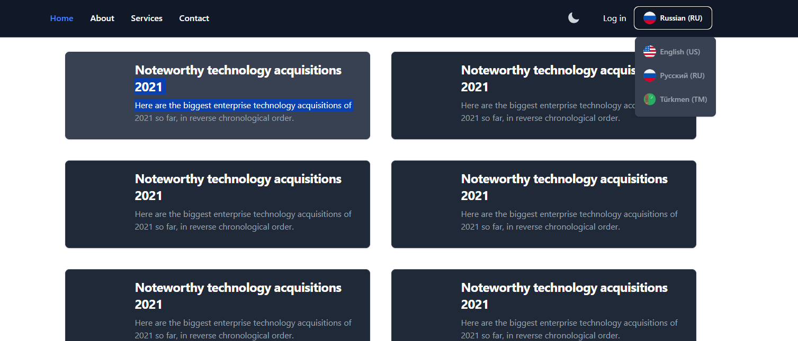
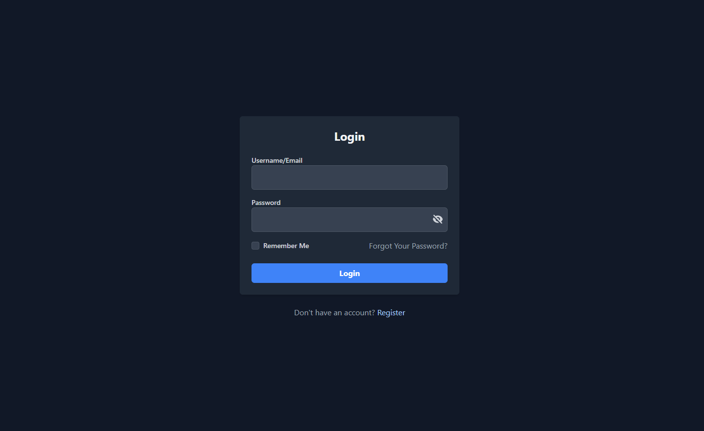
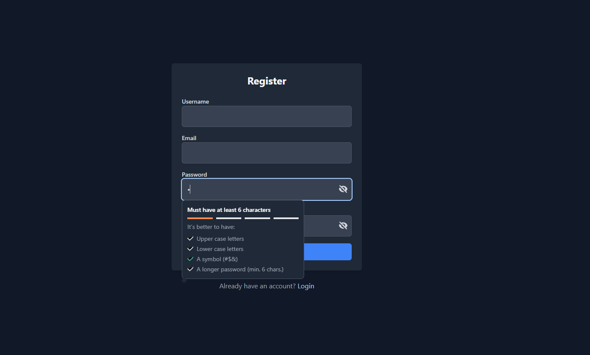
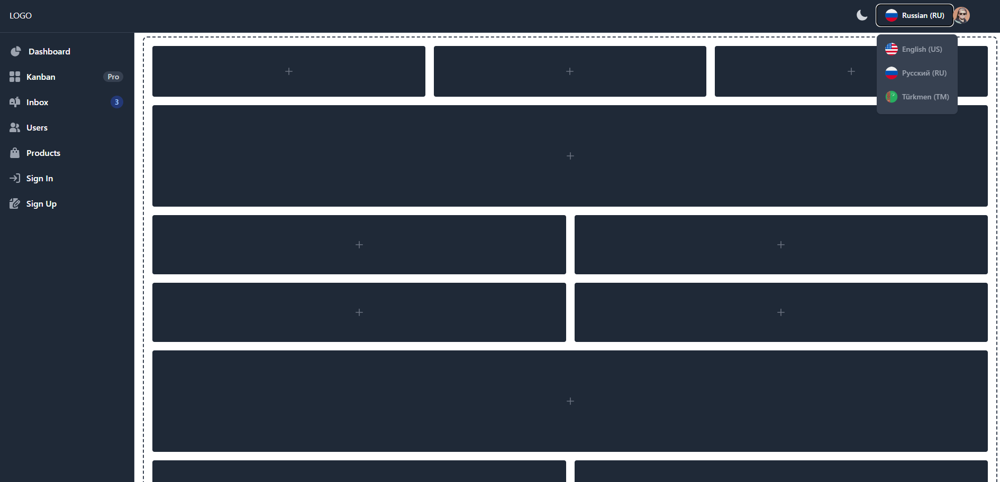

# Название проекта

Livewire authentification page

## Requirements

- PHP >= 8.1
- Laravel 11.x
- Composer
- MySQL or other database

## Установка

Пошаговая инструкция по установке проекта.
 * composer update
 * php artisan key:generate
 * php artisan migrate
 * npm i
 * npm run dev

## Использование

Примеры использования, с объяснением параметров и результата.

## Вклад

Правила и инструкции по внесению изменений и предложению идей.

## Лицензия

Информация о лицензии проекта.
